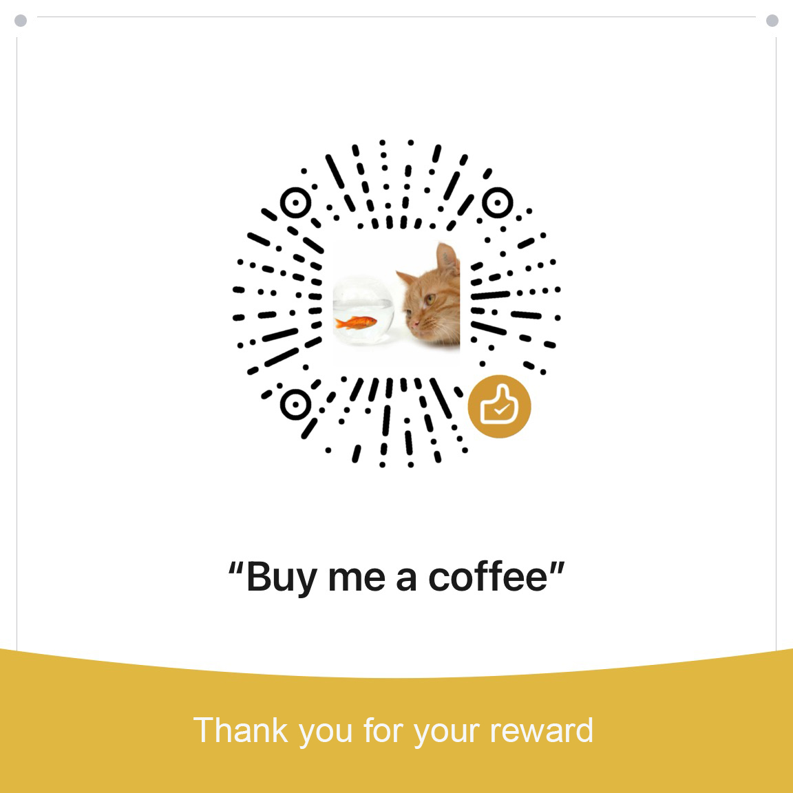
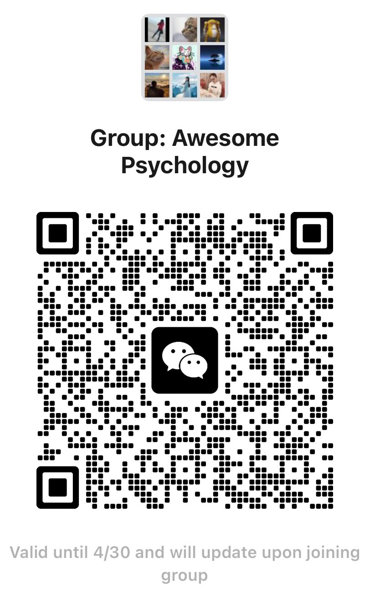

# Awesome-Psychology-Learning 

 

[心理学](https://zh.wikipedia.org/wiki/%E5%BF%83%E7%90%86%E5%AD%A6)（[Psychology](https://en.wikipedia.org/wiki/Psychology)）是一门研究人类和动物的心理现象、意识和行为的科学。它既是一门理论学科，也是一门应用学科。心理学的研究领域众多，作为一名心理学爱好者，按照个人理解，收集和整理心理学相关资源作为学习索引，以书籍为主，其他材料为辅：
- 内容基于现代心理学，资源众多无法穷尽，不定时补充完善；
- 书籍按照`中文名、英文名、作者`的方式展示：
  - 点击书籍名称进入中文版豆瓣页面；
  - 点击作者名称进入作者个人主页或 Wikipedia 介绍；
  - 部分书籍的中文翻译版次远落后英文版，条件允许时建议阅读英文原版；
- 若有资源补充或发现资源链接失效、错误等欢迎提交 issues ；
- 部分资源需要科学上网才可以访问；
- 欢迎心理学爱好者或从业者[加入群组](#支持与交流)一起交流 :)
- [本仓库地址](https://github.com/holyshell/awesome-psychology-learning)。

## 目录

- [心理学史](#心理学史)
- [心理学研究方法](#心理学研究方法)
- [心理学入门](#心理学入门)
- [心理学分支](#心理学分支)
  - [社会心理学](#社会心理学)
  - [发展心理学](#发展心理学)
  - [异常心理学](#异常心理学)
  - [认知心理学](#认知心理学)
  - [人格心理学](#人格心理学)
- [心理咨询](#心理咨询)
- [心理学家](#心理学家)
- [心理学组织](#心理学组织)
- [心理学其他资源](#心理学其他资源)
- [支持与交流](#支持与交流)

## 心理学史

> Psychology has a long past, but a short history.
>
> Hermann Ebbinghaus

百科词条：[心理学史](https://zh.wikipedia.org/wiki/%E5%BF%83%E7%90%86%E5%AD%A6%E5%8F%B2)、[History of psychology](https://en.wikipedia.org/wiki/History_of_psychology)。

### 书籍

[心理学的故事](https://book.douban.com/subject/36826773/)（The Story of Psychology）- [Morton Magill Hunt](https://en.wikipedia.org/wiki/Morton_Hunt)

[心理学史导论](https://book.douban.com/subject/34923499/)（An Introduction to the History of Psychology）- [Baldwin R. Hergenhahn](https://en.wikiquote.org/wiki/Baldwin_R._Hergenhahn)

[现代心理学史](https://book.douban.com/subject/26270925/)（A History of Modern Psychology）- [Duane P. Schultz](https://duaneschultz.com/)

[心理学史](https://book.douban.com/subject/30266685/)（A History of Psychology）- [Eric B. Shiraev](http://www.ericshiraev.com/)

[心理学史](https://book.douban.com/subject/36982387/)（The history of psychology）- [Sarah-Jayne Blakemore](https://en.wikipedia.org/wiki/Sarah-Jayne_Blakemore)

[人类心理3000年](https://book.douban.com/subject/36473409/)（A History of Psychology: From Antiquity to Modernity）- Thomas Hardy Leahey

[DK心理学百科](https://book.douban.com/subject/35169650/)（The psychology book）

### 在线资源

[B站：南师大西方心理学史](https://www.bilibili.com/video/BV1Wt411P7qZ)

[B站：北师大心理学史](https://www.bilibili.com/video/BV1TN411J7Z3)

## 心理学研究方法

> Psychological research requires an interdisciplinary perspective.
>
> Erik Erikson

百科词条：[心理学研究方法列表](https://zh.wikipedia.org/wiki/%E5%BF%83%E7%90%86%E5%AD%B8%E7%A0%94%E7%A9%B6%E6%96%B9%E6%B3%95%E5%88%97%E8%A1%A8)、[List of psychological research methods](https://en.wikipedia.org/wiki/List_of_psychological_research_methods)。

### 书籍

[心理学研究方法](https://book.douban.com/subject/31116998/)（Exploring Research）- [Neil J. Salkind](https://es.wikipedia.org/wiki/Neil_J._Salkind)

[心理学研究方法](https://book.douban.com/subject/21611724/)（Conducting Research in Psychology）- Brett W Pelham 

[心理学研究方法](https://book.douban.com/subject/4770564/)（Research Methods in Psychology）- John J. Shaughnessy

[心理与行为科学研究方法](https://book.douban.com/subject/25952188/)（Methods in Behavioral Research）- Paul C. Cozby

[心理统计导论](https://book.douban.com/subject/26865274/)（Understanding Statistics in the Behavioral Sciences）- Robert R. Pagano

[行为科学统计](https://book.douban.com/subject/36140702/)（Statistics for the Behavioral Sciences）- Frederick J. Gravetter

[行为科学研究方法](https://book.douban.com/subject/35109455/)（Research Methods for the Behavioral Sciences）- Frederick J. Gravetter

[实证研究](https://book.douban.com/subject/26605900/)（Practical Research: Planning and Design）- Paul D. Leedy

### 在线资源

[B站：华南师大心理学研究方法](https://www.bilibili.com/video/BV167411w7bh/)

## 心理学入门

入门部分包含教材和科普，除了导论外也将普通心理学涵盖在内。

> The effective study of psychology requires active participation in experiments and research. Hands-on practice is essential to understanding human behavior.
>
> Burrhus Frederic Skinner

### 书籍

[心理学导论](https://book.douban.com/subject/26952944/)（Psychology: Themes and Variations）- Wayne Weiten

[心理学导论](https://book.douban.com/subject/25798422/)（Introduction to Psychology）- Dennis Coon

[心理学与生活](https://book.douban.com/subject/36591182/)（Psychology and Life）- [Richard J. Gerrig](https://zh.wikipedia.org/wiki/%E7%90%86%E6%9F%A5%E5%BE%B7%C2%B7%E6%A0%BC%E9%87%8C%E6%A0%BC)（[配套网站](https://www.learner.org/series/discovering-psychology/)）

[津巴多普通心理学](https://book.douban.com/subject/35897952/)（Psychology: Core Concepts）- [Philip George Zimbardo](https://philipzimbardo.com/)

[迈尔斯普通心理学](https://book.douban.com/subject/36648213/)（Exploring Psychology）- [David Myers](https://davidmyers.org/)

[什么是心理学](https://book.douban.com/subject/20474429/)（What is Psychology? Essentials）- Ellen E. Pastorino

[心理科学](https://book.douban.com/subject/27203295/)（Psychological Science）- Mark Krause

[这才是心理学](https://book.douban.com/subject/35289980/)（How to Think Straight about Psychology）- [Keith E. Stanovich](https://en.wikipedia.org/wiki/Keith_Stanovich)

[改变心理学的40项研究](https://book.douban.com/subject/34913747/)（Forty Studies that Changed Psychology）- Roger R. Hock

[心理学的邀请](https://book.douban.com/subject/35434444/)（Invitation to Psychology）- Carole Wade

[心理学原理](https://book.douban.com/subject/33460908/)（The Principles of Psychology）- [William James](https://en.wikipedia.org/wiki/William_James)

### 在线资源

[Crash Course：10分钟心理学速成](http://v.163.com/special/opencourse/crashcoursepsychology.html)（[源视频](https://www.youtube.com/playlist?list=PL8dPuuaLjXtOPRKzVLY0jJY-uHOH9KVU6)）

[耶鲁公开课：心理学导论](https://open.163.com/newview/movie/free?pid=CHKLH433I&mid=FHKLH46T9)（[官网](https://oyc.yale.edu/introduction-psychology/psyc-110)、[Coursera](https://www.coursera.org/learn/introduction-psychology)）

[MIT公开课：心理学导论](https://www.youtube.com/playlist?list=PL44ABC9278E2EE706)（[官网](https://ocw.mit.edu/courses/9-00sc-introduction-to-psychology-fall-2011/)）

[哈佛公开课：心理学导论](https://www.bilibili.com/video/BV1hZ4y1w7kd)（[官网](https://stevenpinker.com/classes/psychological-science-science-living-systems-20)）

[Coursera：心理学入门](https://www.coursera.org/learn/introduction-psych)

[YouTube：什么是心理学](https://www.youtube.com/watch?v=5NvR33f5gLw)

[B站：清华公开课心理学与生活](https://www.bilibili.com/video/BV1j14y147QJ/)

[B站：上海大学心理学基础](https://www.bilibili.com/video/BV1Wf4y1Z7No)

[B站：华中师大心理学入门](https://www.bilibili.com/video/BV14E411n7HH/)

[B站：探索心理学](https://www.bilibili.com/video/BV15s411X7Ms)

[YouTube：A Level Psychology](https://www.youtube.com/playlist?list=PLPyIFM6OV7iscUdUE_0AXLcXvyb2zvmIb)

[YouTube：PSYC 200 - Intro to Psychology (Fall 2013)](https://www.youtube.com/playlist?list=PLVHY3HvnI6yMIotukmARTlrCk2q8RXCHg)

## 心理学分支

在入门后，根据个人兴趣或职业发展需要学习不同领域，[心理学分支](https://zh.wikipedia.org/wiki/Category:%E5%BF%83%E7%90%86%E5%AD%B8%E5%88%86%E6%94%AF)众多，仅整理部分，其他分支内容待后续完善。

### 社会心理学

百科词条：[社会心理学](https://zh.wikipedia.org/wiki/%E7%A4%BE%E4%BC%9A%E5%BF%83%E7%90%86%E5%AD%A6)、[Social psychology](https://en.wikipedia.org/wiki/Social_psychology)。

#### 书籍

[社会心理学](https://book.douban.com/subject/36249823/)（The Social Psychology）- [Elliot Aronson](https://en.wikipedia.org/wiki/Elliot_Aronson)

[社会心理学](https://book.douban.com/subject/26701760/)（Social Psychology）- [David Myers](https://davidmyers.org/)

[社会性动物](https://book.douban.com/subject/34970886/)（The Social Animal）- [Elliot Aronson](https://en.wikipedia.org/wiki/Elliot_Aronson)

[态度改变与社会影响](https://book.douban.com/subject/30310479/)（The Psychology of Attitude Change and Social Influence）- [Philip George Zimbardo](https://philipzimbardo.com/)

[社会心理学](https://book.douban.com/subject/30734417/)（Social Psychology）- Nyla R. Branscombe

[社会认知](https://book.douban.com/subject/20563266/)（Social Cognition: Making Sense of People）- [Ziva Kunda](https://en.wikipedia.org/wiki/Ziva_Kunda)

[决策与判断](https://book.douban.com/subject/34984211/)（The Psychology of Judgment and Decision Making）- [Scott Plous](https://en.wikipedia.org/wiki/Scott_Plous)

[文化性动物](https://book.douban.com/subject/35461029/)（The Cultural Animal）- [Roy Baumeister](https://en.wikipedia.org/wiki/Roy_Baumeister)

[亲密关系](https://book.douban.com/subject/36787449/)（Intimate Relationships）- Rowland S. Miller

[人性实验](https://book.douban.com/subject/35377601/)（Experiments With People）- Kurt P. Frey

[对权威的服从](https://book.douban.com/subject/26778782/)（Obedience to Authority: An Experimental View）- [Stanley Milgram](https://en.wikipedia.org/wiki/Stanley_Milgram)

#### 在线资源

[Coursera：社会心理学](https://www.coursera.org/learn/social-psychology)

[edx：Introduction to Social Psychology](https://www.edx.org/learn/social-psychology/the-university-of-queensland-introduction-to-social-psychology)（[YouTube](https://www.youtube.com/playlist?list=PLRG9RdAejnIWF6lt3AtqeC7Ux-stOx___)）

[加利福尼亚大学洛杉矶分校公开课：社会心理学](https://www.bilibili.com/video/BV1Q4411z7f7/)

[美国德克萨斯A&M大学：社会心理学 ](https://www.youtube.com/playlist?list=PLcqwiM3DoZY4eO7zbDo8-RMAXJu1zAg4J) （[开放教科书](https://opentextbc.ca/socialpsychology/#navigation)）

[国立清华大学：社会心理学](https://ocw.nthu.edu.tw/ocw/index.php?page=course&cid=86)（[bilibili](https://www.bilibili.com/video/BV1Rp4y1p7cy)）

[B站：南开大学社会心理学](https://www.bilibili.com/video/BV1Dt41137fy)

[YouTube：PSY 2510 Social Psychology](https://www.youtube.com/playlist?list=PLApmiahrmPkt_XrCDZJqfKVQQQQO8b1hi)

### 发展心理学

百科词条：[发展心理学](https://zh.wikipedia.org/wiki/%E5%8F%91%E5%B1%95%E5%BF%83%E7%90%86%E5%AD%A6)、[Developmental psychology](https://en.wikipedia.org/wiki/Developmental_psychology)。

#### 书籍

[发展心理学](https://book.douban.com/subject/36039538/)（Development Across the Life Span）- Robert Feldman

[伯克毕生发展心理学](https://book.douban.com/subject/35623788/)（Development Through the Lifespan）- Laura E. Berk

[发展心理学上册](https://book.douban.com/subject/25727582/)、[下册](https://book.douban.com/subject/25727585/)（Human Development）- [Diane Papalia](https://es.wikipedia.org/wiki/Diane_Papalia)

[毕生发展心理学](https://book.douban.com/subject/35297082/)（The Developing Person Through the Life Span）- Kathleen Stassen Berger

[发展心理学](https://book.douban.com/subject/35124660/)（Essentials of Life-span Development）- John W. Santrock

[发展心理学](https://book.douban.com/subject/26838522/)（Developmental psychology: Childhood and adolescence）- David R. Shaffer

#### 在线资源

[B站：北京大学发展心理学](https://www.bilibili.com/video/BV175411E7VV)

[B站：北师大发展心理学](https://www.bilibili.com/video/BV1f64y1a7BD)

[YouTube：Lecture Series for Intro to Developmental Psy](https://www.youtube.com/playlist?list=PLM3o01n9O7-C8CC-W_qi2o9yYSsKIXUE9)

[YouTube：Developmental Psychology - PSYC 240](https://www.youtube.com/playlist?list=PL5B3KLQNAC5gn9TwYgc19UwdWYuffnXjC)

[Coursera：发展心理学哲学观与方法论](https://www.coursera.org/learn/developmental-psychology)

[YouTube：Developmental Psychology](https://www.youtube.com/playlist?list=PL_4oyk2RBdFcP73P6uT_RrW5dL2c7JfLp)

[YouTube：Psychology - Developmental Psychology](https://www.youtube.com/playlist?list=PLkKvotUGCyLe1GFlKG28RHyzZ1trYOtCu)

### 异常心理学

百科词条：[异常心理学](https://zh.wikipedia.org/wiki/%E7%95%B0%E5%B8%B8%E5%BF%83%E7%90%86%E5%AD%B8)、[Abnormal psychology](https://en.wikipedia.org/wiki/Abnormal_psychology)。

#### 书籍

[变态心理学](https://book.douban.com/subject/27074856/)（Abnormal Psychology）- [Susan Nolen-Hoeksema](https://en.wikipedia.org/wiki/Susan_Nolen-Hoeksema)

[变态心理学](https://book.douban.com/subject/26793159/)（Abnormal Psychology）- [Ann M.Kring](https://en.wikipedia.org/wiki/Ann_Kring)

[变态心理学](https://book.douban.com/subject/1429566/)（Abnormal Psychology）- [Lauren B. Alloy](https://en.wikipedia.org/wiki/Lauren_Alloy)

[变态心理学](https://book.douban.com/subject/27049474/)（Abnormal Psychology: An Integrative Approach）- [David H. Barlow](https://en.wikipedia.org/wiki/David_H._Barlow)

[变态心理学案例集](https://book.douban.com/subject/30378763/)（Casebook in Abnormal Psychology）- Timothy A. Brown

[变态心理学](https://book.douban.com/subject/3601801/)（Abnormal Psychology in a Changing World）- Jeffrey S.Nevid

#### 在线资源

精神障碍诊断与统计手册（DSM）：[官网](https://www.psychiatry.org/psychiatrists/practice/dsm)、[百科](https://zh.wikipedia.org/wiki/%E7%B2%BE%E7%A5%9E%E7%96%BE%E7%97%85%E8%A8%BA%E6%96%B7%E8%88%87%E7%B5%B1%E8%A8%88%E6%89%8B%E5%86%8A)、[中文图书](https://book.douban.com/subject/36818093/)。

国际疾病分类（ICD）：[官网](https://icd.who.int/zh)、[百科](https://zh.wikipedia.org/wiki/ICD-11)、[中文图书](https://book.douban.com/subject/36592438/)。

[Coursera：异常心理学入门](https://www.coursera.org/learn/intro-abnormal-psych)

[北京大学变态心理学](https://resource.pku.edu.cn/index.php?r=course/detail&id=261)（[B站](https://www.bilibili.com/video/BV1ut411n7Bd)、[YouTube](https://www.youtube.com/playlist?list=PLgvxkXbWub7hBUE_NajFuQblPP20t6c1h)）

[B站：首师大异常心理学](https://www.bilibili.com/video/BV1s5411G7oS)

[YouTube：Abnormal Psychology Lecture Series](https://www.youtube.com/playlist?list=PLWFOLgNq3ZDIKmF82FcLEKTlSwS3Rr8x3)

[YouTube：Understanding Abnormal Psychology](https://www.youtube.com/watch?v=vSmf-8bE0mM)

[YouTube：Summer 2021 Abnormal Psychology](https://www.youtube.com/playlist?list=PLhfrdXjovROxEXaho2PjDSA6xHNZskWc3)

[YouTube：Psychological disorders](https://www.youtube.com/playlist?list=PLbKSbFnKYVY1L1SwdOfyozACk1FvrPpQq)

### 认知心理学

百科词条：[认知心理学](https://zh.wikipedia.org/wiki/%E8%AA%8D%E7%9F%A5%E5%BF%83%E7%90%86%E5%AD%B8)、[Cognitive psychology](https://en.wikipedia.org/wiki/Cognitive_psychology)。

#### 书籍

[认知心理学](https://book.douban.com/subject/35237345/)（Cognitive Psychology: Connecting Mind, Research, and Everyday Experience）- E. Bruce Goldstein

[认知心理学及其启示](https://book.douban.com/subject/7067149/)（Cognitive Psychology and It's Implications）- [John Robert Anderson](https://en.wikipedia.org/wiki/John_Robert_Anderson_(psychologist))

[认知心理学](https://book.douban.com/subject/33454093/)（Cognitive Psychology）- Robert L.Solso

[认知心理学](https://book.douban.com/subject/26841308/)（Cognitive Psychology）- [Robert J. Sternberg](https://en.wikipedia.org/wiki/Robert_Sternberg)

[认知心理学](https://book.douban.com/subject/26703735/)（Cognitive Psychology:In and Out of the Laboratory）- Kathleen M. Galotti

[认知心理学](https://book.douban.com/subject/35218618/)（Cognitive Psychology: Applying The Science of the Mind）- Bridget Robinson-Riegler

[心理学与认知科学哲学](https://book.douban.com/subject/26833525/)（Philosophy of Psycology and Cognitive Science）- [Dov M. Gabbay](https://en.wikipedia.org/wiki/Dov_Gabbay)

#### 在线资源

[YouTube：PY2701 (2021) - Cognitive Psychology](https://www.youtube.com/playlist?list=PLWMGRpO3yg6V8rnHZkXjt8S64zMYUfs-K)

[YouTube：Cognitive Psychology Lectures](https://www.youtube.com/playlist?list=PLz-pxsFiarvKU2cNJfasOsNbI8LGtnZ77)

[YouTube：Cognitive Psychology 2021](https://www.youtube.com/playlist?list=PLH9yCT7fJiXC9PwlqV1lKTbIX9PWRToaU)

[edx：Introduction to Cognitive Psychology and Neuropsychology](https://www.edx.org/learn/cognitive-science/university-of-cambridge-introduction-to-cognitive-psychology-and-neuropsychology)

### 人格心理学

百科词条：[人格心理学](https://zh.wikipedia.org/wiki/%E4%BA%BA%E6%A0%BC%E5%BF%83%E7%90%86%E5%AD%B8)、[Personality psychology](https://en.wikipedia.org/wiki/Personality_psychology)。

#### 书籍

[人格心理学](https://book.douban.com/subject/26838504/)（Theories of Personality）- [Duane P. Schultz](https://duaneschultz.com/)

[人格心理学](https://book.douban.com/subject/26004131/)（ Introduction to Personality ）- [Jerry M. Burger](https://jerrymburger.com/)

[人格心理学](https://book.douban.com/subject/28505771/)（The Personality Puzzle）- [David C. Funder](https://en.wikipedia.org/wiki/David_C._Funder)

[人格心理学](https://book.douban.com/subject/35863547/)（Personality Psychology:Understanding Yourself and Others）- [Jean Marie Twenge](https://en.wikipedia.org/wiki/Jean_Twenge)

[人格心理学](https://book.douban.com/subject/7045751/)（Perspectives on Personality）- Charles S.Carver

#### 在线资源

[B站：首师大人格心理学](https://www.bilibili.com/video/BV1ek4y197eZ)

[B站：北师大人格心理学](https://www.bilibili.com/video/BV1cCYrehE6Z)

[B站：多伦多大学人格及其转变](https://www.bilibili.com/video/BV1Kr4y1Q7oD/)

[TED：Who are you, really? The puzzle of personality](https://www.youtube.com/watch?v=qYvXk_bqlBk)

[YouTube：Personality Psychology](https://www.youtube.com/playlist?list=PLg999NlgHHrSm0uH_jPdx3a5gZghq31TU)

[YouTube：Intro to Psychology Theories of Personality](https://www.youtube.com/watch?v=6ZUpATVxixk) 

[YouTube：Personality Psychology Class Lectures](https://www.youtube.com/playlist?list=PLGg5obNb6tEv-0QymemzLqZjnToWn_0l4)

## 心理咨询

心理咨询从业者必须经过专业化的理论学习和实践训练，并获得从业资质，国内外有一定差距；咨询技术、疗法以及各类心理量表数量较多，待后续逐步完善。

### 书籍

[心理咨询师的问诊策略](https://book.douban.com/subject/3858060/)（Interviewing And Change Strategies For Helpers）- [Sherry Cormier](https://www.sherrycormierphd.com/)

[心理咨询与治疗的理论及实践](https://book.douban.com/subject/35309273/)（Theory and Practice of Counseling and Psychotherapy）- Gerald Corey

[心理治疗中的人际过程](https://book.douban.com/subject/35571344/)（Interpersonal Process in Therapy）- Edward Teyber

[心理咨询导论](https://book.douban.com/subject/34874539/)（An Introduction to Counselling）- John McLeod

[心理治疗实战录](https://book.douban.com/subject/25760338/)（Doing Psychotherapy）- Michael Franz Basch

[心理咨询的要素](https://book.douban.com/subject/4169773/)（The Elements of Counseling）- Scott T. Meier

[这就是心理咨询](https://book.douban.com/subject/36759710/)（45 Techniques Every Counselor Should Know）- Bradley T. Erford

[给心理治疗师的礼物](https://book.douban.com/subject/26841312/)（The Gift of Therapy）- [Irvin David Yalom](https://en.wikipedia.org/wiki/Irvin_D._Yalom)

[心理咨询面谈技术](https://book.douban.com/subject/25851444/)（Clinical Interviewing）- John Sommers-Flanagan

[以人为中心心理咨询实战](https://book.douban.com/subject/26301702/)（Person-centred counselling in action）- Dave Mearns

[认知行为疗法](https://book.douban.com/subject/36815051/)（Cognitive Behavior Therapy: Basics and Beyond）- [Judith S. Beck](https://en.wikipedia.org/wiki/Judith_S._Beck)

### 在线资源

[B站：华师大心理咨询与技术](https://www.bilibili.com/video/BV1dz4y1C75m)

[B站：西南交大心理咨询理论和技术](https://www.bilibili.com/video/BV17k4y1k7AF)

[B站：南大心理咨询的理论与方法](https://www.bilibili.com/video/BV1BR4y1x7L5)

## 心理学家

请参考百科词条[心理学家](https://zh.wikipedia.org/wiki/%E5%BF%83%E7%90%86%E5%AD%B8%E5%AE%B6)（[Psychologist](https://en.wikipedia.org/wiki/Psychologist)）、[心理学家列表](https://zh.wikipedia.org/wiki/%E5%BF%83%E7%90%86%E5%AD%A6%E5%AE%B6%E5%88%97%E8%A1%A8)（[List of psychologists](https://en.wikipedia.org/wiki/List_of_psychologists)）或各类书籍中提及的。

## 心理学组织

心理学领域相关机构或组织。

[国际心理科学联合会](https://www.iupsys.net/) (International Union of Psychological Science, IUPsyS)

[国际应用心理学协会](https://iaapsy.org/) (International Association of Applied Psychology, IAAP)

[欧洲心理学联合会](https://www.efpa.eu/) (European Federation of Psychologists’ Associations, EFPA)

[心理科学协会](https://www.psychologicalscience.org/) (Association for Psychological Science, APS)

[世界心理治疗联合会](https://www.worldpsyche.org/) (World Council for Psychotherapy, WCP)

[国际心理健康协会](https://imha.ngo/) ( International Mental Health Association,IMHA)

[国际精神分析协会](https://www.ipa.world/)（International Psychoanalytical Association,IPA）

[中国心理学会](https://www.cpsbeijing.org/) (Chinese Psychological Society, CPS)

[美国心理学会](https://www.apa.org/)（American Psychological Association, APA）

[美国心理咨询协会](https://www.counseling.org/)（American Counseling Association,ACA）

[加拿大心理学会](https://cpa.ca/) (Canadian Psychological Association, CPA)

[英国心理学会](https://www.bps.org.uk/) (British Psychological Society, BPS)

[澳大利亚心理学会](https://psychology.org.au/) (Australian Psychological Society, APS)

[新加坡心理学会](https://singaporepsychologicalsociety.org/) (Singapore Psychological Society, SPS)

[日本心理学会](https://psych.or.jp/) (Japanese Psychological Association, JPA)

[韩国心理学会](https://www.koreanpsychology.or.kr/eng/main/main.html) (Korean Psychological Association, KPA)

## 心理学其他资源

### Publications

[APA and Affiliated Journals](https://www.apa.org/pubs/journals)

[Psychological Science](https://journals.sagepub.com/home/pss)

[CPS - 心理科学](https://jps.ecnu.edu.cn/CN/1671-6981/home.shtml)

[CPS - 心理学报](https://journal.psych.ac.cn/xlxb/CN/0439-755X/home.shtml)

[心理科学进展](https://journal.psych.ac.cn/xlkxjz/CN/1671-3710/home.shtml)

[PsyArXiv Preprints](https://osf.io/preprints/psyarxiv)

[中国心理学预印本平台](https://psych.chinaxiv.org/server/index.htm)

[Frontiers in Psychology](https://www.frontiersin.org/journals/psychology)

## 支持与交流
> 如果这些内容对你有帮助，可以请我喝杯咖啡☕，或加入交流群，我们一起聊聊心理学:)

| 微信赞赏码                   | 微信交流群                         | 联系我                  |
|----------------------------|----------------------------------|-------------------------|
| |  | 

